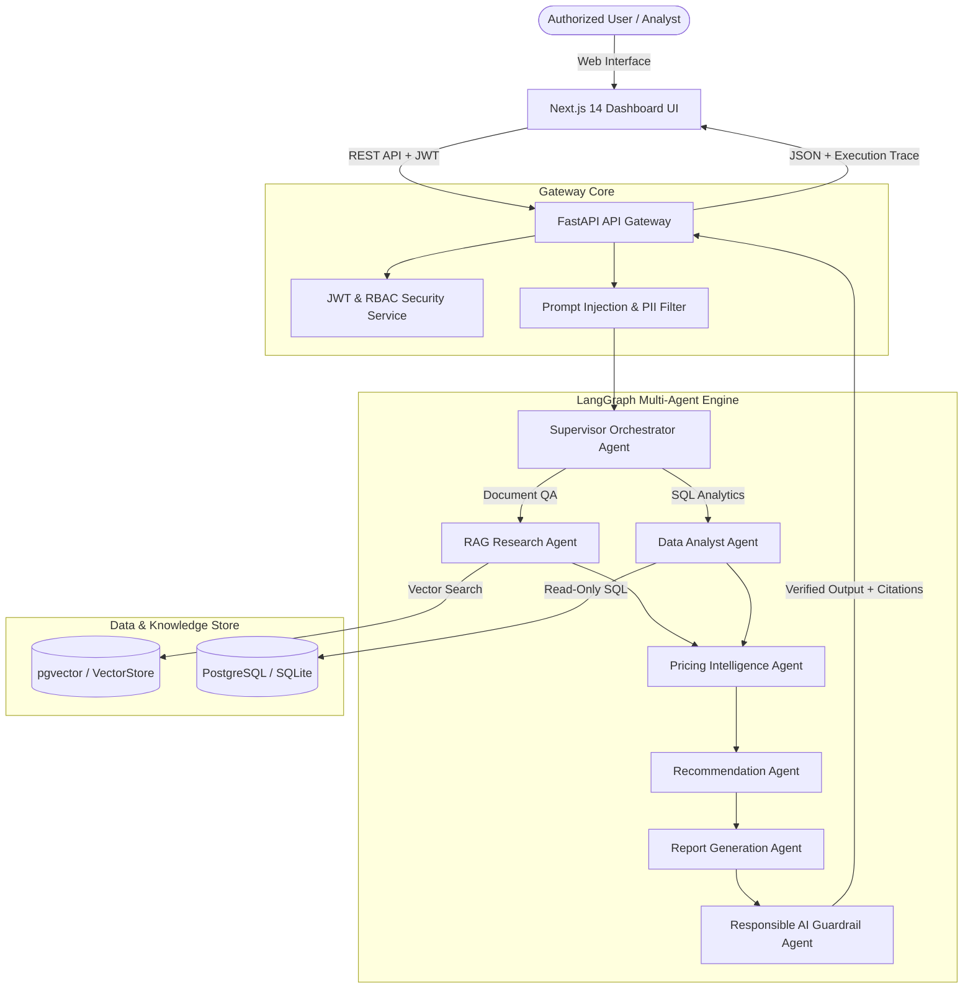

# FinAI Nexus

## Enterprise Agentic AI Platform for Pricing Intelligence & Decision Automation

[](https://www.python.org/)
[](https://fastapi.tiangolo.com/)
[](https://python.langchain.com/docs/langgraph)
[](https://nextjs.org/)
[](https://www.docker.com/)
[](LICENSE)

---

## 1. Executive Summary & Overview

**FinAI Nexus** is a production-style enterprise decision-support platform engineered for **pricing intelligence**, **interchange fee optimization**, and **revenue risk mitigation**. 

Rather than functioning as a standard conversational chatbot, FinAI Nexus unifies **unstructured enterprise policy documents** (PDFs, interchange schedules, regional guidelines) with **structured relational transaction databases** through a **stateful multi-agent architecture** powered by **LangGraph**.

The system enables financial analysts, pricing directors, and revenue management teams to perform hybrid reasoning—answering questions that require both document context lookups and direct read-only SQL dataset aggregations.

---

## 2. Key Capabilities

- 🤖 **Multi-Agent Orchestration**: Dynamic intent classification and graph routing across 7 autonomous agents using **LangGraph**.
- 📄 **Multimodal RAG Pipeline**: Parsing, semantic chunking, pgvector indexing, and verifiable citation extraction for enterprise policy documents.
- 📊 **Natural Language to SQL**: Safe, read-only SQL query generation and execution against synthetic transaction data with automated Recharts visualization.
- 🔍 **Pricing & Margin Audit**: Automated detection of merchant accounts billed below mandatory pricing rule thresholds.
- 🛡️ **Responsible AI Layer**: Hallucination detection, citation verification, PII redaction, and prompt injection prevention.
- 📈 **AI Observability & LLMOps**: Node-by-node execution tracing, token usage, latency waterfall breakdown, and automated response evaluation benchmarks.
- 🚀 **Offline Demo Mode**: Runs zero-dependency `DEMO_MODE=true` without requiring external LLM API keys.

---

## 3. System Architecture



---

## 4. Multi-Agent Fleet

FinAI Nexus orchestrates 7 specialized autonomous agents:

| Agent Name | Node Identifier | Primary Responsibility |
|---|---|---|
| **Supervisor Orchestrator** | `supervisor_node` | Classifies query intent and builds dynamic graph execution plan. |
| **RAG Research Agent** | `rag_node` | Queries vector database, retrieves document chunks, and formats citations. |
| **Data Analyst Agent** | `data_analyst_node` | Generates read-only SQL, validates queries, executes DB aggregations, generates chart specs. |
| **Pricing Intelligence** | `pricing_agent_node` | Compares policy rules vs actual transaction rates to identify margin violations. |
| **Recommendation Agent** | `recommendation_agent_node` | Formulates actionable executive business recommendations with confidence ratings. |
| **Report Generation** | `report_agent_node` | Synthesizes structured executive intelligence reports. |
| **Responsible AI Layer** | `responsible_ai_node` | Audits candidate outputs for hallucination risk, citations, and PII. |

---

## 5. Technology Stack

- **Backend**: Python 3.11+, FastAPI, Pydantic v2, SQLAlchemy 2.0, Alembic, PyMuPDF, pdfplumber.
- **AI & Orchestration**: LangGraph, LangChain, OpenAI API, Gemini API, Custom Mock LLM Provider.
- **Data & Vector Storage**: PostgreSQL 16 with `pgvector`, SQLite (local fallback), Redis.
- **Frontend**: Next.js 14 (App Router), TypeScript, Tailwind CSS, Recharts, Lucide Icons.
- **Infrastructure**: Docker, Docker Compose, GitHub Actions CI/CD.

---

## 6. Quick Start & Local Development

### Option A: Local Execution (Fastest)

1. **Clone Repository & Setup Environment**:
   ```bash
   git clone https://github.com/priyanjul-beep/FinAI-Nexus.git
   cd FinAI-Nexus
   ```

2. **Install Python Backend Dependencies**:
   ```bash
   pip install -r backend/requirements.txt
   ```

3. **Seed Database & Index Sample Documents**:
   ```bash
   python -m backend.app.database.seed
   python -m backend.app.database.index_documents
   ```

4. **Run Pytest Test Suite**:
   ```bash
   pytest
   ```

5. **Start FastAPI Backend**:
   ```bash
   python -m uvicorn backend.main:app --host 0.0.0.0 --port 8000
   ```
   *FastAPI docs will be live at `http://localhost:8000/docs`.*

6. **Start Next.js Frontend**:
   ```bash
   cd frontend
   npm install
   npm run dev
   ```
   *Dashboard will be live at `http://localhost:3000`.*

---

### Option B: Docker Compose Setup

Run the entire platform (PostgreSQL with `pgvector`, Redis, FastAPI Backend, Next.js Frontend) with a single command:

```bash
docker compose up --build
```

---

## 7. Production Demo Scenarios

The system includes 8 pre-configured demo scenarios:

1. **Scenario 1**: *"Which region generated the highest revenue in Q2?"* (SQL Data Analysis)
2. **Scenario 2**: *"Why did revenue decline in Region A?"* (Pricing Analysis)
3. **Scenario 3**: *"According to the pricing policy, which products are outside the recommended pricing range?"* (Hybrid RAG + SQL)
4. **Scenario 4**: *"Compare pricing strategy across India and Singapore."* (Multi-Region RAG)
5. **Scenario 5**: *"Find products where pricing increased but transaction volume decreased."* (Pricing Elasticity)
6. **Scenario 6**: *"Generate an executive pricing performance report for Q2."* (Full Report Generation)
7. **Scenario 7**: *"Summarize the uploaded pricing policy and identify important constraints."* (Document Summary RAG)
8. **Scenario 8**: *"According to the pricing policy, what is the recommended pricing range for Product X and how does our current pricing compare?"* (Full Hybrid Orchestration)

---

## 8. Documentation Index

- [System Architecture](docs/architecture.md)
- [Multi-Agent System](docs/agents.md)
- [RAG & Vector Search](docs/rag.md)
- [Responsible AI & Guardrails](docs/responsible-ai.md)
- [LLMOps & Observability](docs/llmops.md)
- [Platform Security & Auth](docs/security.md)
- [API Documentation](docs/api.md)
- [AWS Cloud Deployment Guide](docs/aws-deployment.md)
