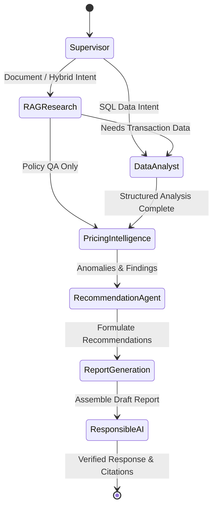

# Multi-Agent Architecture & LangGraph Orchestration

## Overview

FinAI Nexus uses **LangGraph** to coordinate multi-agent workflows. The system does not rely on simple prompt chaining; instead, a **Supervisor Orchestrator Agent** dynamically evaluates user queries and routes execution across specialized autonomous agents.

## Agent Roles & Responsibilities

1. **Supervisor Orchestrator Agent (`supervisor_node`)**
   - Classifies query intent (`DOCUMENT_QA`, `DATA_ANALYSIS`, `PRICING_ANALYSIS`, `REVENUE_ANALYSIS`, `HYBRID_ANALYSIS`, `REPORT_GENERATION`).
   - Builds dynamic multi-step execution plan.

2. **RAG Research Agent (`rag_node`)**
   - Queries pgvector vector database for relevant policy document chunks.
   - Generates document citations including page numbers and exact snippets.

3. **Data Analyst Agent (`data_analyst_node`)**
   - Translates natural language requests into read-only SQL queries.
   - Enforces strict read-only execution security (prevents `DROP`, `DELETE`, `UPDATE`, `INSERT`).
   - Generates structured chart data specifications for Recharts visualization.

4. **Pricing Intelligence Agent (`pricing_agent_node`)**
   - Compares document policy rules against actual database transaction rates.
   - Detects pricing violations (e.g., merchant rates billed below mandatory gross margin thresholds).

5. **Recommendation Agent (`recommendation_agent_node`)**
   - Synthesizes findings into actionable business recommendations.
   - Assigns confidence levels (`HIGH`, `MEDIUM`, `LOW`) and lists key operational assumptions.

6. **Report Generation Agent (`report_agent_node`)**
   - Assembles structured executive reports with Executive Summary, Key Findings, Supporting Evidence, and Strategic Recommendations.

7. **Responsible AI Guardrail Agent (`responsible_ai_node`)**
   - Audits candidate outputs for hallucination risk, citation groundedness, PII redaction, and prompt injection attempts.
