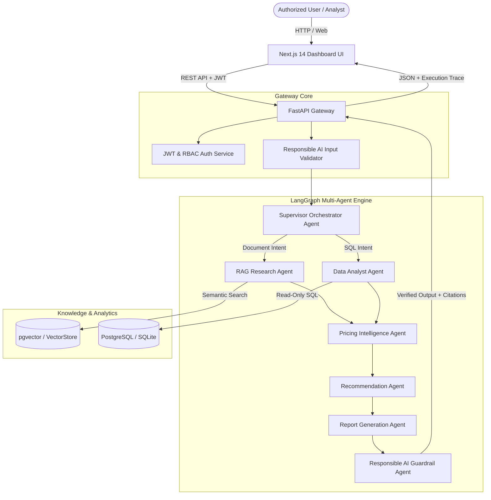

# FinAI Nexus - System Architecture

## Overview

FinAI Nexus is an Enterprise Agentic AI Platform designed for pricing intelligence, interchange fee optimization, and automated business decision support. The platform unifies unstructured policy documents (PDFs, Markdown guides) with structured transactional data (PostgreSQL database) using a stateful multi-agent orchestration architecture powered by **LangGraph**.

## Key Components

1. **Frontend**: Next.js 14 (App Router), TypeScript, Tailwind CSS, Recharts, Lucide Icons.
2. **API Gateway**: FastAPI with async route handling, Pydantic validation, and JWT RBAC security.
3. **Multi-Agent Engine**: LangGraph state machine with dynamic intent-based routing across 7 autonomous agents.
4. **Vector Store**: pgvector on PostgreSQL (or in-memory fallback for local execution) storing document chunk embeddings.
5. **Relational Database**: PostgreSQL with SQLAlchemy ORM storing users, transactions, interchange rates, pricing rules, agent traces, and evaluations.
6. **Observability & LLMOps**: Telemetry tracer tracking latency waterfall per node, token consumption, and response quality evaluations.
