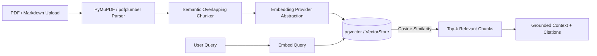

# RAG & Multimodal Document Intelligence

## Overview

FinAI Nexus features a complete RAG (Retrieval-Augmented Generation) pipeline for parsing, chunking, indexing, and retrieving enterprise pricing and interchange policy documents.

## Features

- **Document Parsing**: Supports PDF and Markdown formats. PyMuPDF handles page extraction, while pdfplumber provides fallback support.
- **Semantic Chunking**: 600-character chunk sizes with 100-character overlapping windows to preserve cross-sentence context.
- **pgvector Vector Database**: Embeddings stored in PostgreSQL using pgvector, enabling fast cosine similarity lookups.
- **Provider Abstraction**: Switch seamlessly between OpenAI (`text-embedding-3-small`), Gemini, and a deterministic hash-based Mock provider for zero-credential offline execution (`DEMO_MODE=true`).
- **Verifiable Citations**: Every RAG answer outputs document filename and page number citations.
